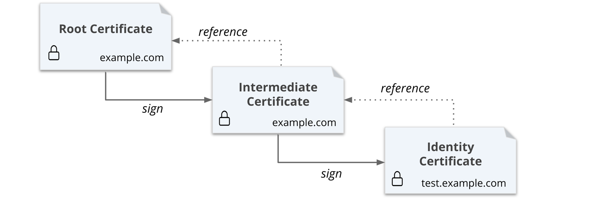

# Build Your Own Certificate Authority (CA)

## Requirements
Install: 
* jq tool https://stedolan.github.io/jq/download/
* Vault CLI https://www.vaultproject.io/downloads

## Diagram



### Generate root CA

```
$ export VAULT_ADDR=http://127.0.0.1:8200
$ export VAULT_TOKEN=<<TOKEN>>
```

Enable secrets engine and custom 1 year
```
$ vault secrets enable pki
$ vault secrets tune -max-lease-ttl=8760h pki
```

Generate the crt domain.com 1 year
```
$ vault write -field=certificate pki/root/generate/internal \
     common_name="domain.com" \
     issuer_name="root-2022" \
     ttl=8760h > root_2022_ca.crt
```

Create role for the root CA
```
$ vault write pki/roles/2022-servers allow_any_name=true
```

Configure the CA and CRL URLs
```
$ vault write pki/config/urls \
     issuing_certificates="$VAULT_ADDR/v1/pki/ca" \
     crl_distribution_points="$VAULT_ADDR/v1/pki/crl"
```


### Generate intermediate CA

Enable secrets engine and custom 6 months
```
$ vault secrets enable -path=pki_int pki
$ vault secrets tune -max-lease-ttl=4380h pki_int
```

Execute the following command to generate an intermediate and save the CSR as pki_intermediate.csr
```
$ vault write -format=json pki_int/intermediate/generate/internal \
     common_name="domain.com Intermediate Authority" \
     issuer_name="domain-dot-com-intermediate" \
     | jq -r '.data.csr' > pki_intermediate.csr
```

Sign the intermediate certificate with the root CA private key, and save the generated certificate as intermediate.cert.pem
```
$ vault write -format=json pki/root/sign-intermediate \
     issuer_ref="root-2022" \
     csr=@pki_intermediate.csr \
     format=pem_bundle ttl="4380h" \
     | jq -r '.data.certificate' > intermediate.cert.pem

```

Once the CSR is signed and the root CA returns a certificate, it can be imported back into Vault.
```
$ vault write pki_int/intermediate/set-signed certificate=@intermediate.cert.pem
```

### Create Role

Create a role named example-dot-com which allows subdomains, and specify the default issuer ref ID as the value of issuer_ref
```
$ vault write pki_int/roles/example-dot-com \
     issuer_ref="$(vault read -field=default pki_int/config/issuers)" \
     allowed_domains="example.com" \
     allow_subdomains=true \
     max_ttl="720h"
```

### Request certificates

Execute the following command to request a new certificate for the test.example.com domain based on the example-dot-com role. 24 hours
```
$ vault write pki_int/issue/example-dot-com common_name="test.example.com" ttl="4380h"
```

## Reference

* https://learn.hashicorp.com/tutorials/vault/pki-engine