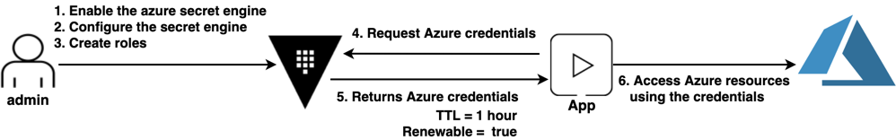

# Azure secrets engine

## Requirements
Install: 
* Vault CLI https://www.vaultproject.io/downloads

## Diagram



### Create an Azure Service principal

Create a Service Principal in Azure: App Registration

Create a Secret

Assign Azure Microsoft Graph Permissions

Select Delegated permissions

| Permission Name | Type |
| --- | --- |
| Application.Read.Al | Application |
| Application.ReadWrite.All | Application |
| Application.ReadWrite.OwnedBy | Application |
| Directory.Read.Al | Application |
| Directory.ReadWrite.All | Application |
| Group.Read.All | Application |
| Group.ReadWrite.All | Application |
| GroupMember.Read.All | Application |
| GroupMember.ReadWrite.All | Application |

Grant admin consent for Default Directory

This Service Principal should be Owner of the Resource: Subscription or Management Group...

### Configure Vault

Connect to Vault
```
$ export VAULT_ADDR=http://127.0.0.1:8200
$ export VAULT_TOKEN=<<TOKEN>>
```

Enable Azure secrets engine 
```
$ vault secrets enable azure
```

Configure the Service Principal with the credentials
```
vault write azure/config \
     subscription_id=$SUBSCRIPTION_ID  \
     client_id=$CLIENT_ID \
     client_secret=$CLIENT_SECRET \
     tenant_id=$TENANT_ID \
     use_microsoft_graph_api=true
```

### Create Role

Create a Vault role that will be instantiated 
```
$ vault write azure/roles/edu-app ttl=1h azure_roles=-<<EOF
    [
      {
        "role_name": "Contributor",
        "scope": "/subscriptions/$SUBSCRIPTION_ID/resourceGroups/vault-education"
      }
    ]
EOF
```

### Request Azure credential

Execute the following command to request a new certificate for the test.example.com domain based on the example-dot-com role. 24 hours
```
$ vault read azure/creds/edu-app
```

## Reference

* https://learn.hashicorp.com/tutorials/vault/azure-secrets